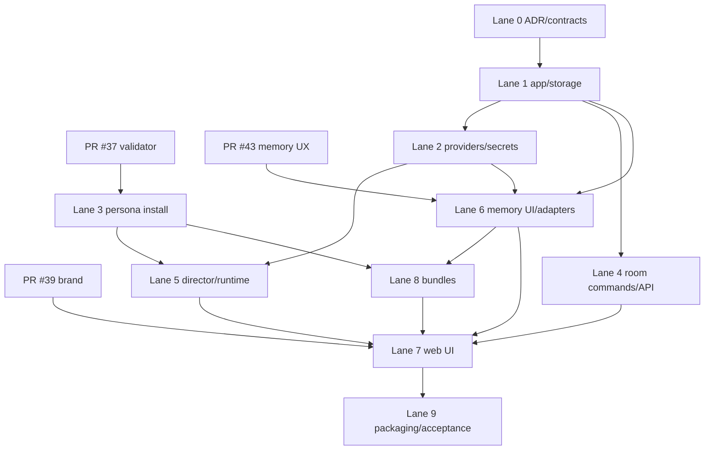

# First Downloadable Local Alpha Implementation Plan

> **For Hermes:** Use the `subagent-driven-development` skill to implement this plan task-by-task. Each implementation lane is a separate pull request; observe RED before GREEN and require spec review before quality/security review.

**Issue:** [#30](https://github.com/Jdelg718/the-green-room/issues/30)

**Milestone:** `First downloadable local alpha`

**Planning baseline:** The Green Room `d72c1ff96ed229545957055dfd85c3eae8c26dd4`

**Deliverable type:** implementation plan only; this change adds no production code, starts no service, handles no real provider key, and performs no deployment.

**Goal:** Deliver a free, private, one-command local web application where a nontechnical user can configure Ollama or a BYO hosted provider, run a director-controlled room with one human and up to three validated personas, restart with provenance-linked continuity, and export, import, back up, or delete the complete room without exporting secrets.

**Architecture:** Build a standalone, single-host application rather than making the first downloadable alpha depend on the still-unproven Buzz relay integration. One non-root Python process owns the HTTP API, per-room runtime, and SQLite event store and serves a compiled React client; provider calls are isolated behind adapters. Keep Green Room event envelopes compatible with a future Buzz bridge, but do not ship Postgres, Redis, object storage, Nostr keys, ACP, or a Buzz fork in this milestone.

**Tech stack:** Python 3.13, FastAPI/Uvicorn, standard-library `sqlite3`, Pydantic v2, HTTPX, PyNaCl, React 19, TypeScript 5, Vite, npm, uv, Playwright, Pytest/Hypothesis, and Docker Compose v2.

---

## 1. Inputs inspected and decisions carried forward

This plan resolves the merged product/architecture documents, prototypes, and spike plans at the stated baseline, plus active work that is not yet on `main`.

| Input | Status at planning time | Decision carried into this plan |
| --- | --- | --- |
| `docs/PRODUCT-BRIEF.md`, `ROADMAP.md`, `docs/ARCHITECTURE.md` | merged | The room is the product; silence and bounded fan-out are runtime invariants; packs are inert; memory is inspectable and deletable. |
| `docs/research/buzz-extension-surface.md`, `docs/research/event-flow.md` | merged research | Buzz exposes useful future protocol seams, but has no proven invisible cross-persona scheduler or durable Green Room memory. Preserve source/decision IDs in local events; do not block the alpha on Buzz. |
| `docs/plans/phase0d-live-buzz-integration.md` | merged plan, live spike not completed | Reuse its transactional ideas—source-event uniqueness, generation epochs, sign/submit fencing, explicit migrations—not its multi-container relay/signers topology. |
| `spikes/001-bounded-director/` | merged spike | Port the tested hard scheduler rules into production modules; do not import spike modules at runtime. |
| `docs/PERSONA-PACK-SPEC.md` and runtime file-role contract | merged | Provider submission must reuse the validator's immutable persona bytes; metadata and assets never enter model context. |
| [PR #37](https://github.com/Jdelg718/the-green-room/pull/37) strict validator | active, based on current `main` | Merge/review before the persona-install lane. Import `greenroom_persona` as a library; do not duplicate archive parsing or extract hostile packs. |
| Historical gallery and room-builder prototype | merged | Keep one human plus zero-to-three personas, typed catalog-view data, honest candidate state, native controls, mobile room access, and no scraping of prototype labels. |
| Custom persona wizard | merged | Custom packs remain local/private, validation is production—not prototype—validation, and rehearsal transcript/state is excluded from pack export. Full authoring can follow the alpha; alpha must import and inspect generated packs. |
| [PR #39](https://github.com/Jdelg718/the-green-room/pull/39) Backstage Electric | active selected brand work | Merge/review before UI productionization. Reuse tokens and product terms, not the standalone page's static data. Portraits remain candidate assets until catalog admission. |
| [PR #43](https://github.com/Jdelg718/the-green-room/pull/43) memory setup | active design work | Merge/review before memory UI. Implement Built-in Local first and a bounded Obsidian managed-subtree adapter; self-hosted adapter remains an interface and offline state, not arbitrary plug-in execution. |
| Issue #30 comments | live product-owner clarification | No project cloud account or hosted user data; app is free while hosted models may cost money; local and hosted choices are equally visible; credentials and private memory never enter exports. |

### Decision that supersedes provisional assumptions

`docs/adr/0000-hosting-placement.md` describes a shared private Buzz deployment and says local inference is outside that alpha. Issue #30's newer downloadable/BYO-local requirement changes the product boundary. Lane 0 must record an accepted ADR that scopes ADR 0000 to the earlier hosted experiment and chooses a standalone SQLite local bundle for this milestone. This is not a finding that Buzz is unusable; it is a YAGNI decision until the Phase 0D live evidence exists.

## 2. Concrete product boundary

### Included in the first downloadable alpha

- Browser UI served on loopback by one application container/process.
- One human and one-to-three locally installed, loadable persona packs.
- Deterministic hard policy plus a structured model-assisted director that selects zero or one speaker.
- OpenAI-compatible, Anthropic, Ollama, and deterministic mock provider adapters.
- SQLite immutable event log and rebuildable projections.
- Episode summaries, staged memories, relationship state/history, provenance, confidence, correction, forget, reset, and compaction records.
- Built-in local memory plus an optional managed Obsidian subtree mirror.
- Safe portable room bundle, backup/restore, archive/delete, and local data-location display.
- One app image/Compose service; optional Ollama Compose profile; mock mode requires no key and no model download.

### Explicitly excluded

- Buzz relay, Postgres, Redis, S3/object storage, Nostr identity, ACP, or a maintained Buzz fork.
- Public ingress, accounts, telemetry, a project cloud, sync service, marketplace, or public pack publishing.
- Tauri/desktop shell, installers, auto-update, mobile apps, or a second storage format.
- Arbitrary memory plug-ins, arbitrary provider URLs supplied by packs, external tools, voice cloning, or unbounded context.
- Official catalog admission implied by a source directory, portrait, prototype, or successful validation.

## 3. Process topology and repository layout

```text
Browser on 127.0.0.1
  | HTTP JSON commands + SSE room stream
  v
app (one non-root Python process)
  FastAPI router
  application services
  per-room asyncio queue (one active generation per room)
  director + persona runtime
  provider adapters ----HTTPS----> selected hosted endpoint
        |                         or http://ollama:11434
        v
  SQLite WAL + bounded local files under /data
  secret store under /secrets (never under /data/exports)
  compiled web/ served as same-origin static assets

Optional Compose profile: ollama (loopback/internal only, its own model volume)
No reverse proxy, worker queue, cron container, or public port in the alpha.
```

Use `uv` as the authoritative Python resolver/runner and retain the root `pyproject.toml`/`uv.lock` introduced by PR #37. Use `npm ci` and `web/package-lock.json` for the browser build. Do not add pnpm, Yarn, Poetry, Hatch workspaces, an ORM, or a JavaScript server.

```text
compose.yaml
Dockerfile
.env.example
pyproject.toml
uv.lock
migrations/
  0001_event_store.sql
  0002_memory.sql
  0003_bundle_imports.sql
schemas/
  room-bundle-1.schema.json
src/
  greenroom_persona/              # from PR #37; hostile persona boundary
  greenroom/
    __init__.py
    cli.py
    config.py
    api/
      app.py
      errors.py
      health.py
      providers.py
      personas.py
      rooms.py
      memories.py
      bundles.py
      stream.py
    db/
      connection.py
      migrations.py
      event_store.py
      projections.py
      backup.py
    domain/
      events.py
      rooms.py
      director.py
      memory.py
      bundles.py
    providers/
      base.py
      capabilities.py
      mock.py
      ollama.py
      openai_compatible.py
      anthropic.py
      redaction.py
    runtime/
      coordinator.py
      policy.py
      director.py
      context.py
      persona.py
      cancellation.py
    memory/
      service.py
      candidate.py
      summarizer.py
      relationships.py
      retrieval.py
      backends/
        base.py
        local.py
        obsidian.py
    personas/
      installer.py
      catalog.py
      prompt.py
    bundles/
      exporter.py
      importer.py
      limits.py
    static/                       # generated Vite output; ignored in source
web/
  package.json
  package-lock.json
  tsconfig.json
  vite.config.ts
  src/
    main.tsx
    app.tsx
    api/client.ts
    api/events.ts
    styles/tokens.css
    styles/base.css
    routes/setup.tsx
    routes/library.tsx
    routes/room-builder.tsx
    routes/room.tsx
    routes/memory.tsx
    routes/data.tsx
    components/
    test/
tests/
  unit/
  integration/
  contract/
  e2e/
  fixtures/
    providers/
    room-bundles/
docs/
  adr/0002-first-downloadable-alpha-stack.md
  architecture/provider-adapter-contract.md
  architecture/storage-and-memory-lifecycle.md
  architecture/portable-room-bundle.md
  security/secret-storage-threat-model.md
  runbooks/first-downloadable-alpha.md
  runbooks/backup-restore-delete.md
scripts/
  greenroom
  verify-alpha.sh
```

Generated `src/greenroom/static/`, runtime `.greenroom-data/`, `.env`, provider secrets, SQLite `-wal`/`-shm`, exports, backups, and Ollama models must be ignored. Release images copy a clean Vite build into `src/greenroom/static/`; development serves Vite separately only through `npm run dev`.

## 4. Dependency graph and merge/review order



Review and merge in this order:

1. Finish independent review of PRs #37, #39, and #43. They may merge in any order, but their dependent lane cannot begin from copied unmerged files.
2. Lane 0 establishes contracts; merge it before production code.
3. Lane 1 establishes the package, migrations, and event authority.
4. Lanes 2, 3, and 4 may proceed in parallel in non-overlapping paths after Lane 1; Lane 3 additionally requires PR #37.
5. Lanes 5 and 6 may proceed in parallel after their graph prerequisites.
6. Lane 8 lands before the final UI wiring so import/export state is real, not mocked.
7. Lane 7 integrates the complete vertical product and requires brand/memory design work.
8. Lane 9 packages and verifies the exact merged head. Release approval/tagging is a separate owner decision.

Each lane receives, in order: implementation/spec review, test-sabotage evidence where a new invariant is claimed, quality review, security/privacy review for boundary changes, then rebase and full affected-suite verification. Never merge a lane whose tests depend on another unmerged branch.

## 5. Exact contracts

### 5.1 HTTP and stream contract

- Bind `127.0.0.1:8787` by default. A non-loopback bind requires an explicit `GREENROOM_ALLOW_REMOTE=1` startup acknowledgement and is not documented as the alpha happy path.
- Version JSON under `/api/v1`. Commands use request IDs and return stable error codes; create/import/provider-test commands are idempotent.
- Use SSE at `/api/v1/rooms/{room_id}/events?after=<seq>` for persisted events and ephemeral generation status. The client reconnects using `Last-Event-ID`; SQLite sequence is the resume cursor.
- Mutations are POST/PUT/DELETE HTTP commands, not client-authored events. The server alone appends canonical events.
- Health endpoints: `/health/live` checks process; `/health/ready` checks migrations, writable data directory, required SQLite PRAGMAs, and static assets without calling a provider.

### 5.2 SQLite/event-store authority

Use standard-library `sqlite3` with parameterized SQL and explicit transaction functions; no ORM. One connection per request/task, WAL mode, `foreign_keys=ON`, `synchronous=FULL`, bounded `busy_timeout`, and owner-only data directory. Migrations are numbered SQL resources tracked in `schema_migrations`; startup applies them transactionally and refuses unknown/newer schema versions.

Core tables:

- `rooms`, `participants`, `persona_installations`, `room_participants`, `provider_profiles` (no secret value), and `room_model_assignments`.
- `room_events(seq INTEGER PRIMARY KEY, event_id TEXT UNIQUE, room_id, type, actor_id, source_event_id, decision_id, generation_epoch, payload_json, created_at)`; append-only triggers reject update/delete.
- `director_decisions` with `UNIQUE(room_id, source_event_id, policy_version)` and exactly one of selected persona or silence.
- `generation_runs` with state, cancellation token, provider request metadata, usage, error code, and epoch fence.
- `episode_summaries`, `memory_candidates`, `memories`, `memory_sources`, `relationship_revisions`, `compactions`, `retrieval_documents`, and `memory_backend_state`.
- `bundle_imports`, `deletion_receipts`, and `idempotency_keys`.

Every user-visible projection can be dropped and rebuilt from room events plus immutable committed memory records. Event payloads are canonical UTF-8 JSON (sorted keys, no NaN/Infinity). IDs are UUIDv7 generated server-side; timestamps are UTC RFC 3339 with microseconds. Store provider name/model/capability snapshot and token counts, never prompts containing secrets or provider headers.

### 5.3 Provider adapter and capability contract

`providers/base.py` exposes `test_connection(profile)`, `list_models(profile)` when supported, `complete(request, cancel) -> Completion`, and `stream(request, cancel) -> AsyncIterator[Delta]`. `CompletionRequest` contains only normalized messages, model, temperature, output-token limit, timeout, and strict optional JSON schema; it cannot carry arbitrary headers, tools, files, URLs, or credentials. The server resolves a secret reference immediately before an adapter call.

Adapters:

- **Ollama:** fixed default `http://ollama:11434` in Compose or validated loopback URL for host Ollama; `/api/tags` and `/api/chat`; no key.
- **OpenAI-compatible:** default `https://api.openai.com/v1`, user may set an HTTPS base URL or loopback HTTP URL; `/models` is optional and `/chat/completions` is required. Reject embedded credentials, query secrets, redirects to disallowed origins, and per-request base URL changes.
- **Anthropic:** fixed `https://api.anthropic.com`, `/v1/messages`, explicit API version header, no custom endpoint in alpha.
- **Mock:** fixture-driven deterministic director/persona/summary/memory output, network disabled, no key.

Capability records declare context window, structured-output support, streaming, token usage reporting, model-list support, local/hosted, and known cost status. Unknown context/cost is displayed as unknown—not zero. The runtime computes a conservative context budget and fails before provider submission rather than truncating persona bytes.

### 5.4 Secret storage threat model

- Default hosted-key flow is session-only memory. “Remember on this device” is explicit.
- Native runs try an OS keyring reference through `keyring`; values never enter SQLite.
- Compose cannot honestly claim an OS keychain. Remembered keys are a libsodium `SecretBox` ciphertext in `/secrets/provider-secrets.json` (mode 0600) using a 32-byte master key from `/run/secrets/greenroom_master_key`. The master key is created by the setup CLI into a separate host file (mode 0600) and mounted read-only; it is never generated into `.env`, the image, database, logs, backup, or bundle.
- If no secure backend/master-key mount is available, persistence is disabled and the UI offers session-only entry. Never silently fall back to plaintext.
- Encryption here protects accidental database/export/backup disclosure, not a host administrator or malware that can read both ciphertext and mounted key. State that limitation in UI/docs.
- Structured logging redacts authorization headers, known secret values, keys matching secret-name patterns, provider request bodies, and URL query strings. Crash reports/telemetry are absent.

### 5.5 Director and runtime

One `asyncio.Queue` and worker task per active room serializes room commands. A human message transaction appends the message and claims a source decision. The hard policy first applies pause/epoch, duplicate, cast membership, max-consecutive-turn, cooldown, autonomous-depth, per-human fan-out, token/cost, and one-in-flight constraints. Only eligible persona IDs reach the director prompt.

The director returns `{speaker_id|null, reason_code, rationale_public, urgency}` under a strict schema. The runtime validates eligibility again after the model returns. Invalid, timed-out, cancelled, over-budget, or stale-epoch decisions become explicit silence/error events. `rationale_public` is bounded and displayed as “why selected/silenced”; hidden chain-of-thought is neither requested nor stored.

The persona request consists of separate ordered segments: immutable validator prompt bytes; system safety/runtime policy; bounded recent events; current episode summary; eligible committed memories and relationship revisions with source IDs; scene card; director invitation. Metadata-only pack files, other personas' private memories, secrets, deleted records, and uncommitted candidates are excluded. Provider output is inert text, never interpreted as a tool call.

Pause stops new work. Stop increments the persisted generation epoch, signals cancellation, and prevents all old-epoch results from committing. Restart marks abandoned in-flight runs interrupted and permits deterministic retry only from the original persisted source under idempotency rules.

### 5.6 Memory lifecycle and backends

1. Append immutable room events.
2. At bounded thresholds (default 12 new dialogue events or 4,000 estimated tokens), create an episode-summary candidate with exact source sequence range and provider/model/prompt-template version.
3. Generate memory and relationship candidates from only that range plus prior committed state.
4. Validate schema, source IDs/range, participant scope, confidence `[0,1]`, no secret patterns, no post-delete references, and bounded text.
5. Commit accepted candidates transactionally as immutable revisions; rejection remains inspectable but never retrievable.
6. Rebuild deterministic retrieval documents from active committed revisions. Alpha retrieval is SQLite FTS5 lexical ranking plus recency/confidence; no embedding service is required.
7. Compaction creates a new version linked to every replaced record; old versions remain provenance, not retrieval input.
8. Correct creates a superseding user revision. Forget tombstones selected memory/relationship revisions and rebuilds retrieval. Reset creates a room-wide memory reset event and excludes all earlier derived memory while preserving transcript unless the user separately deletes it.

`MemoryBackend` receives already validated committed records. Built-in Local is authoritative SQLite. Obsidian writes atomic Markdown notes only under `<chosen vault>/Green Room/<room-id>/`, maintains an app-owned manifest, never scans the rest of the vault, detects conflicts, and treats notes as a user-visible mirror/import source—not executable instructions. Disconnect leaves notes by default; erase removes only manifest-owned paths after a preview. “Self-hosted adapter” displays the designed offline state and interface documentation but does not load arbitrary code in the alpha.

### 5.7 Portable room bundle

Extension: `.greenroom-room`; format: bounded ZIP with one ASCII root directory. Import uses the same hostile-archive principles as persona packs: one bounded read, no extraction, traversal, links, devices, executable files, ambiguous names, duplicate/case-colliding paths, ZIP64, encryption, unsupported compression, excessive ratios, or unknown required roles.

```text
room-<uuid>/
  manifest.json
  events.jsonl
  summaries.jsonl
  memories.jsonl
  relationships.jsonl
  compactions.jsonl
  participants.json
  provider-profiles.json          # provider/model/capabilities; no secret refs or values
  personas/<installation-id>.greenroom
  checksums.json
```

`manifest.json` carries format `1.0`, exporter app/schema versions, room ID/title, UTC export time, source sequence ceiling, and exact file counts/byte limits. `checksums.json` binds every other member by SHA-256. JSONL lines are canonical and schema checked. Export occurs from one SQLite read snapshot to a temporary owner-only file, fsyncs, then atomically renames. Import validates everything before one transaction, validates embedded personas through `greenroom_persona`, remaps colliding local IDs deterministically while preserving original IDs as provenance, and appends an import event. No SQLite file, key, secret reference, log, cache, rejected candidate, Obsidian path, or private setup value is included.

Delete is two-phase in UX but one durable operation: preview counts/paths, require exact room-title confirmation, cancel work/increment epoch, delete room-scoped DB rows in one transaction (events may be removed because this is whole-room erasure), remove app-owned files, checkpoint/VACUUM according to the documented local remanence limitation, and emit a non-content deletion receipt. Do not promise forensic secure erasure on SSD/COW/backups; list remaining user-managed exports/backups/Obsidian notes separately.

## 6. Test strategy and quality gates

- **Unit:** policy, context budgeting, canonical events, migrations, provider normalization, redaction, memory validation/ranking, bundle schemas/limits.
- **Property/state-machine:** random event sequences cannot exceed one decision per source, one in-flight run, configured fan-out/cost bounds, or revive a stopped epoch; bundle order and IDs cannot change canonical import result.
- **Contract:** recorded synthetic provider fixtures for all adapters; adapter receives byte-identical inspected persona segment; no live keys in CI.
- **Integration:** temporary real SQLite files with two connections, crash/reopen, WAL/backup, concurrent idempotency, cancellation fences, memory commit/rebuild, export/import/delete.
- **Browser E2E:** Chromium plus one Firefox lane; setup, library, builder, ten mock turns, stop, restart, provenance inspector, export/import/delete; 1440, 390, and 320 widths; keyboard and reduced motion.
- **Compose smoke:** build from a clean checkout, no-key mock profile, optional Ollama profile, persistent volume restart, health checks, non-root/read-only settings, loopback bind.
- **Security:** hostile bundles/personas, URL/redirect SSRF controls, log/fixture secret scan, ZIP/resource exhaustion, prompt metadata exclusion, XSS-safe rendering, no external client requests, dependency audit/SBOM.
- **Manual Ollama acceptance:** one reviewed small instruct model; record model digest, host resources, timings, limitations, and real output. Mock success is not evidence of model quality.

Canonical pre-merge gate after all lanes:

```bash
uv sync --all-groups --locked
uv run ruff format --check .
uv run ruff check .
uv run mypy src/greenroom src/greenroom_persona
uv run pytest -q
uv run bandit -c pyproject.toml -r src
uv export --frozen --no-dev --format requirements-txt -o /tmp/greenroom-runtime.txt
uv run pip-audit -r /tmp/greenroom-runtime.txt
npm --prefix web ci
npm --prefix web run format:check
npm --prefix web run lint
npm --prefix web run typecheck
npm --prefix web run test
npm --prefix web run build
npm --prefix web run test:e2e
./scripts/verify-alpha.sh

git diff --check origin/main...HEAD
docker compose config --quiet
docker compose --profile mock build --pull
```

## 7. Bite-sized TDD tasks by mergeable PR lane

Every numbered checkbox is one 2–5 minute focused action. A task is complete only after the named command produces the expected result. Commits may combine adjacent GREEN tasks into one coherent commit; do not commit a deliberately RED tree. **Task count: 100.**

### Lane 0 — architecture and executable contracts (owner: architecture; 8 tasks)

- [ ] **A01** Create `docs/adr/0002-first-downloadable-alpha-stack.md`; assert in its checklist that standalone SQLite is selected and ADR 0000 is scoped, then run `python3 -m compileall -q scripts` (no code expected) and `git diff --check`.
- [ ] **A02** Create `docs/architecture/provider-adapter-contract.md` with the exact normalized request/result/capability fields and endpoint policy above; validate Markdown links with the repository's chosen Markdown checker.
- [ ] **A03** Create `docs/architecture/storage-and-memory-lifecycle.md` with the tables, invariants, lifecycle, deletion semantics, and rebuild procedure; peer-review every mutable table against an event/provenance source.
- [ ] **A04** Create `schemas/room-bundle-1.schema.json` and `docs/architecture/portable-room-bundle.md`; add a valid and invalid JSON example, then parse schema/examples with `python3 -m json.tool`.
- [ ] **A05** Create `docs/security/secret-storage-threat-model.md`; threat-model host admin, malicious pack, malicious bundle, browser XSS, backup disclosure, logs, and provider endpoint abuse; explicitly record non-goals.
- [ ] **A06** Add `docs/architecture/api-v1.openapi.yaml` for setup/providers/personas/rooms/memory/bundles/SSE; parse it with a locked OpenAPI validator and reject undocumented response/error shapes.
- [ ] **A07** Add `docs/architecture/dependency-rationale.md` naming every planned runtime dependency, license, purpose, and rejected alternative; run the license-policy check before any dependency lands.
- [ ] **A08** Run spec review against issue #30 and active PRs #37/#39/#43, close discrepancies in these documents, run `git diff --check`, and merge Lane 0 before implementation lanes.

### Lane 1 — package, configuration, migrations, event authority (owner: backend foundation; 11 tasks)

- [ ] **B01** Add a failing import test `tests/unit/test_app_import.py` for `greenroom.__version__`; run it to observe `ModuleNotFoundError`.
- [ ] **B02** Add `src/greenroom/__init__.py` and merge application dependencies/tool config into root `pyproject.toml`; run the focused test GREEN and `uv lock --check`.
- [ ] **B03** Add failing `tests/unit/test_config.py` cases for loopback default, explicit remote acknowledgement, owner-only data paths, and unknown environment keys.
- [ ] **B04** Implement `src/greenroom/config.py` with strict Pydantic settings; run B03 GREEN and sabotage one remote-bind guard to prove the test bites.
- [ ] **B05** Add failing migration tests for empty DB, reopen, unknown newer version, rollback, and `schema_migrations` checksums in `tests/integration/test_migrations.py`.
- [ ] **B06** Create `migrations/0001_event_store.sql` and `src/greenroom/db/{connection,migrations}.py`; run B05 GREEN against temporary on-disk SQLite, not `:memory:`.
- [ ] **B07** Add failing PRAGMA/path tests for WAL, foreign keys, FULL sync, busy timeout, owner-only directory, and refusal of tmp/ephemeral configured data paths.
- [ ] **B08** Implement connection/path verification and append-only triggers; run B07 GREEN and direct-SQL update/delete sabotage tests.
- [ ] **B09** Add failing canonical event tests for UUIDv7, UTC timestamp, canonical JSON, unique event ID, actor/source/decision/epoch fields, and NaN rejection.
- [ ] **B10** Implement `domain/events.py` and `db/event_store.py`; run unit plus two-connection duplicate/race tests GREEN.
- [ ] **B11** Add projection rebuild tests, implement `db/projections.py`, drop/rebuild a room projection from events, then run all Lane 1 tests and independent DB invariant review.

### Lane 2 — provider adapters, capability budget, and secrets (owner: provider/security; 11 tasks)

- [ ] **C01** Add failing protocol/type tests for `ProviderAdapter`, normalized requests, deltas, completion usage, stable errors, and cancellation in `tests/unit/providers/test_base.py`.
- [ ] **C02** Implement `providers/base.py` and `capabilities.py`; run C01 GREEN with no network.
- [ ] **C03** Add failing deterministic mock fixture tests for director, persona, summary, malformed, timeout, and cancellation modes.
- [ ] **C04** Implement `providers/mock.py` using only local fixture data; run C03 GREEN and prove socket creation is denied in the test.
- [ ] **C05** Add RED HTTPX `MockTransport` contract tests for Ollama tags/chat/stream, bounds, errors, and cancellation; implement `providers/ollama.py`; run GREEN.
- [ ] **C06** Add RED contract tests for OpenAI-compatible models/chat/stream, unknown usage, base-URL validation, redirect/origin rejection, and error redaction; implement and run GREEN.
- [ ] **C07** Add RED contract tests for Anthropic messages/stream/version header, capability limits, errors, and cancellation; implement and run GREEN.
- [ ] **C08** Add failing context-budget tests for exact immutable persona bytes, reserved output, unknown windows, and no silent truncation; implement conservative budgeting in `capabilities.py`.
- [ ] **C09** Add failing secret-store tests for session-only, unavailable persistence, native keyring references, Compose SecretBox, wrong/missing master key, file modes, and zero DB secret values.
- [ ] **C10** Implement `providers/secrets.py` and `providers/redaction.py`; run C09 GREEN and scan captured logs/exceptions/URLs for sentinel secrets.
- [ ] **C11** Run all adapter contracts, mypy, Bandit, dependency/license audit, and an SSRF/log-redaction security review; record that CI used no live endpoint or key.

### Lane 3 — validated persona installation and typed catalog (owner: persona boundary; 8 tasks; requires PR #37)

- [ ] **D01** Rebase after PR #37 and add a failing library integration test asserting loadable report version, immutable prompt bytes, digest, and metadata/prompt separation.
- [ ] **D02** Implement `personas/prompt.py` as a thin adapter over `greenroom_persona`; run D01 GREEN and prove no second prompt assembly path exists.
- [ ] **D03** Add failing installer tests for valid archive, rejected report, unsupported report/schema, duplicate installation, version upgrade, and atomic failure.
- [ ] **D04** Implement `personas/installer.py` storing archive bytes/digest and typed view metadata without extraction; run D03 GREEN.
- [ ] **D05** Add failing typed catalog tests that distinguish candidate, fixture, private custom, unavailable, and approved-manifest states without scraping prototype HTML.
- [ ] **D06** Implement `personas/catalog.py`; load current source candidates as development fixtures while preserving truthful candidate/draft labels.
- [ ] **D07** Add provider-boundary sentinel tests proving `PROVENANCE.md`, `SOURCES.md`, manifest scalars, license, assets, and catalog review text are absent from the complete outbound request.
- [ ] **D08** Run PR #37's hostile suite plus installer/catalog integration and sabotage provider-byte reuse; obtain persona-security and content-policy review before merge.

### Lane 4 — room commands, API shell, SSE, and idempotency (owner: API; 9 tasks)

- [ ] **E01** Add failing app-factory and `/health/live`/`ready` tests; implement `api/app.py` and `api/health.py` without provider calls.
- [ ] **E02** Add failing stable-error envelope and request-ID tests; implement `api/errors.py` and reject unknown JSON fields.
- [ ] **E03** Add RED create/edit/archive/duplicate room service tests with one human and zero-to-three persona constraints.
- [ ] **E04** Implement `domain/rooms.py`, room application service, and `api/rooms.py`; run E03 GREEN.
- [ ] **E05** Add RED provider profile/model-assignment endpoint tests proving DB rows contain no secret/reference value leakage; implement `api/providers.py`.
- [ ] **E06** Add RED persona list/install/inspect/uninstall-in-use tests; implement `api/personas.py` over Lane 3 interfaces.
- [ ] **E07** Add failing idempotency-key tests for repeated create, message, import request, mismatch payload, expiry, and two-connection race; implement DB-backed idempotency.
- [ ] **E08** Add failing SSE replay/reconnect tests for ordered persisted sequence, `Last-Event-ID`, heartbeat, disconnect cleanup, and bounded subscriber queues; implement `api/stream.py`.
- [ ] **E09** Run generated OpenAPI conformance, full API integration, browser-origin/CSP/CORS tests, and independent API review before merge.

### Lane 5 — hard policy, director, persona runtime, and cancellation (owner: runtime; 12 tasks)

- [ ] **F01** Port one RED test per merged bounded-director invariant into `tests/unit/runtime/test_policy.py`; do not import `spikes/`.
- [ ] **F02** Implement minimal `runtime/policy.py` for eligibility, silence, cooldown, consecutive turns, autonomous depth/fan-out, and budget; run F01 GREEN.
- [ ] **F03** Add Hypothesis state-machine tests that no event sequence exceeds one decision per source or configured fan-out/consecutive/cost bounds; run and preserve the seed on failure.
- [ ] **F04** Add RED `director_decisions` migration/race tests; create the uniqueness/check constraints and atomic claim-or-replay transaction.
- [ ] **F05** Add RED director-schema tests for eligible speaker, null/silence, unknown speaker, malformed output, bounded public rationale, timeout, and stale policy.
- [ ] **F06** Implement `runtime/director.py` with mock/adapter call and deterministic silence fallback; run F05 GREEN.
- [ ] **F07** Add RED context tests for exact segment ordering, byte-identical persona segment, bounded transcript, eligible active memories only, no secrets/metadata/private sibling state, and over-budget rejection.
- [ ] **F08** Implement `runtime/context.py` and `runtime/persona.py`; run F07 GREEN and provider-boundary sentinel assertions.
- [ ] **F09** Add RED per-room coordinator tests for serialized messages, one in-flight generation, distinct rooms in parallel, pause, restart-interrupted state, and queue bounds.
- [ ] **F10** Implement `runtime/coordinator.py`; run F09 GREEN using deterministic latches rather than sleeps.
- [ ] **F11** Add RED stop/epoch race tests at before-director, after-director, mid-provider, and before-commit barriers; implement cancellation and prove every stale completion affects zero rows.
- [ ] **F12** Run focused sabotage of source uniqueness, eligibility recheck, epoch predicate, and provider-byte identity; restore and run runtime/property/integration plus independent loop/cancellation security review.

### Lane 6 — summaries, memory, relationships, retrieval, and backends (owner: memory; 12 tasks; requires PR #43 before UI tasks)

- [ ] **G01** Add RED migration tests for immutable summary/memory/relationship/compaction revisions, sources, tombstones, confidence bounds, and active-version uniqueness.
- [ ] **G02** Create `migrations/0002_memory.sql`; run G01 GREEN and direct-SQL immutability sabotage.
- [ ] **G03** Add RED threshold/source-range tests for deterministic episode-summary candidate creation; implement `memory/summarizer.py`.
- [ ] **G04** Add RED candidate validation tests for schema, source existence/scope, participant scope, confidence, secret patterns, deleted sources, and text limits; implement `memory/candidate.py`.
- [ ] **G05** Add RED transactional commit/reject/supersede tests and implement `memory/service.py` so candidates never silently become retrievable.
- [ ] **G06** Add RED relationship revision/history/provenance tests and implement `memory/relationships.py` with bounded typed dimensions, confidence, and source IDs.
- [ ] **G07** Add RED FTS5 ranking tests for lexical match, recency/confidence tie-break, tombstone/reset exclusion, stable ordering, and rebuild; implement `memory/retrieval.py`.
- [ ] **G08** Add RED compaction tests proving replacement links, old-version provenance, active retrieval exclusion, and full rebuild; implement compaction.
- [ ] **G09** Add RED correct/forget/reset tests, including restart and context-provider exclusion; implement user revision/tombstone/reset events and projection rebuild.
- [ ] **G10** Add RED `MemoryBackend` and Built-in Local tests; implement `memory/backends/base.py` and `local.py` without arbitrary code loading.
- [ ] **G11** Add RED Obsidian tests for exact managed root, traversal/symlink refusal, atomic write, manifest ownership, conflict/read-only/offline, disconnect-leave, and erase-preview; implement `obsidian.py`.
- [ ] **G12** Run memory provenance/rebuild, privacy sentinel, crash, and backend path-security suites; compare API states to PR #43's required UX states and obtain independent memory review.

### Lane 7 — production web client and complete room UX (owner: frontend/accessibility; 12 tasks; requires PR #39 and backend lanes)

- [ ] **H01** Add `web/` Vite/React/TypeScript scaffold with failing app smoke test, locked npm dependencies, same-origin API client, and no remote asset; make smoke test GREEN.
- [ ] **H02** Translate PR #39's selected tokens/terms into `styles/tokens.css` and `base.css`; add token/contrast snapshot tests without copying static data or implying catalog admission.
- [ ] **H03** Add RED setup-route tests for free-app/cost copy, local vs hosted choice, connection test, capability/context/cost warning, offline state, and session-only vs remember-secret behavior; implement `routes/setup.tsx`.
- [ ] **H04** Add RED library tests for last activity, participants, model, memory status, create/edit/archive/delete/duplicate, loading/empty/error states; implement `routes/library.tsx`.
- [ ] **H05** Add RED catalog/room-builder tests for search/filter/details, honest status, fixed human, capacity three, add/remove focus, productive cues, and mobile room access; implement `routes/room-builder.tsx` from typed API data.
- [ ] **H06** Add RED room timeline tests for persisted sequence, actor, director selected/silenced reason, reconnect replay, generation status, and no chain-of-thought field; implement timeline components.
- [ ] **H07** Add RED room-control tests for message, targeted message, ask everyone, pause/resume, stop, mute/remove, disabled/in-flight states, and keyboard operation; implement real API wiring.
- [ ] **H08** Add RED memory inspector tests for summaries, memories, relationships, source event jump, confidence/provenance, candidate/rejected state, correct, forget, reset, and backend status; implement `routes/memory.tsx`.
- [ ] **H09** Add RED data route tests for data location, export progress/result, import preview/conflicts, backup/restore, delete preview/title confirmation, and honest remanence copy; implement `routes/data.tsx`.
- [ ] **H10** Add SSE store tests for resume cursor, dedup, reconnect, bounded toast/status updates, and route-unmount cleanup; implement `api/events.ts`.
- [ ] **H11** Run component accessibility, DOM-injection, external-request, 44px target, reduced-motion, 1440/390/320 overflow, keyboard/focus, and high-contrast checks; fix all blockers.
- [ ] **H12** Build production assets twice, verify deterministic asset manifest/no source map secrets, serve through FastAPI, run Chromium and Firefox critical E2E, then obtain design/accessibility review.

### Lane 8 — portable bundles, backup/restore, and deletion (owner: data portability/security; 8 tasks)

- [ ] **I01** Add RED bundle-limit/path/header/checksum/schema tests using synthetic fixtures; implement `bundles/limits.py` with one bounded non-extracting read.
- [ ] **I02** Add RED export snapshot tests for canonical member order/bytes, checksums, source ceiling, embedded validated personas, atomic rename, and concurrent room writes.
- [ ] **I03** Implement `bundles/exporter.py`; run I02 GREEN and scan archive names/content recursively for secret/reference/path/cache sentinels.
- [ ] **I04** Add RED import tests for complete prevalidation, corrupt/unknown/missing members, hostile ZIPs, invalid persona, ID collision remap, replayed import, and all-or-nothing rollback.
- [ ] **I05** Implement `bundles/importer.py` and `migrations/0003_bundle_imports.sql`; run I04 GREEN and cross-instance canonical round-trip.
- [ ] **I06** Add RED SQLite online-backup/restore tests for WAL consistency, checksum manifest, wrong/newer schema, restore rollback, and no secrets; implement `db/backup.py`.
- [ ] **I07** Add RED delete tests for preview counts/paths, title confirmation, stop epoch, transactional rows, app-owned files, Obsidian leave/erase choice, receipt, restart absence, and remanence warning; implement delete service/API.
- [ ] **I08** Run hostile corpus, Hypothesis canonical round-trips, export/import/continue/delete E2E, secret scan, and independent archive/deletion security review.

### Lane 9 — Docker Compose, CLI, documentation, and acceptance evidence (owner: release; 9 tasks)

- [ ] **J01** Add RED CLI tests for `init`, `serve`, `doctor`, `backup`, `restore`, `export-room`, `import-room`, `delete-room`, and `demo`; implement `cli.py` plus the `scripts/greenroom` uv/Compose launcher with stable exits and no secret echo.
- [ ] **J02** Add multi-stage `Dockerfile`, `.dockerignore`, and container structure test; prove non-root UID, read-only root, writable `/data`/`/secrets`, no build tools/npm cache/source maps, healthcheck, and graceful stop.
- [ ] **J03** Add `compose.yaml` and `.env.example`; validate loopback port, app volume, master-key secret mount, resource/log bounds, no Docker socket/host network, mock profile, and optional isolated Ollama profile.
- [ ] **J04** Create `scripts/verify-alpha.sh`; make a deliberate check fail, observe nonzero exit, restore, then run clean-checkout mock build/start/health/ten-turn/restart/export/import/delete automatically.
- [ ] **J05** Create `docs/runbooks/first-downloadable-alpha.md` with exact no-key mock and Ollama commands, hosted-provider setup, data location, stop/update/rollback, and troubleshooting.
- [ ] **J06** Create `docs/runbooks/backup-restore-delete.md`; perform backup into a clean instance, restore, compare room/event/memory digests, delete, and record actual commands/output.
- [ ] **J07** Run the no-key acceptance demo below from a clean checkout and store sanitized results, versions, image digest, test counts, timing, and known limitations under `evidence/first-downloadable-alpha/`.
- [ ] **J08** Run the Ollama acceptance below with the reviewed model, then hosted-provider smoke only if an owner explicitly supplies a test key; separate those results from deterministic mock evidence.
- [ ] **J09** Run the complete quality/security/accessibility gates, generate SBOM/checksums, inspect the final diff/artifacts, and hand the release candidate to the owner; do not tag, publish, deploy, or claim release in this lane.

## 8. Acceptance demo commands

These are the commands the completed implementation must make true. They are an executable contract, not commands run by this planning PR.

### 8.1 No API key and no model download: deterministic mock

```bash
git clone https://github.com/Jdelg718/the-green-room.git
cd the-green-room
cp .env.example .env
./scripts/greenroom init --profile mock
docker compose --profile mock up --build -d
curl --fail http://127.0.0.1:8787/health/ready

# Installs reviewed fixture archives, creates Newton/Lovelace/Douglass,
# submits enough scripted human prompts for >=10 controlled total turns,
# and asserts at most one selected persona per source event.
docker compose exec -T app greenroom demo --provider mock \
  --cast org.greenroom.isaac-newton,org.greenroom.ada-lovelace,org.greenroom.frederick-douglass \
  --turns 10 --output /data/evidence/mock-demo.json

docker compose restart app
docker compose exec -T app greenroom demo verify-continuity \
  --evidence /data/evidence/mock-demo.json --require-source-provenance

docker compose exec -T app greenroom export-room --room demo-room \
  --output /data/exports/demo-room.greenroom-room
docker compose exec -T app greenroom delete-room --room demo-room \
  --confirm-title 'Mock acceptance room'
docker compose exec -T app greenroom import-room \
  /data/exports/demo-room.greenroom-room --as imported-demo
docker compose exec -T app greenroom demo continue --room imported-demo --turns 2

docker compose exec -T app greenroom delete-room --room imported-demo \
  --confirm-title 'Mock acceptance room'
docker compose exec -T app greenroom doctor --assert-room-absent imported-demo
docker compose down
```

The mock demo proves orchestration, persistence, provenance, portability, and deletion plumbing. It does not prove persona quality or real-provider compatibility.

### 8.2 No API key: Ollama

```bash
./scripts/greenroom init --profile ollama
docker compose --profile ollama up --build -d
docker compose exec -T ollama ollama pull qwen2.5:7b-instruct
curl --fail http://127.0.0.1:8787/health/ready

docker compose exec -T app greenroom provider test --provider ollama \
  --model qwen2.5:7b-instruct
docker compose exec -T app greenroom demo --provider ollama \
  --model qwen2.5:7b-instruct \
  --cast org.greenroom.isaac-newton,org.greenroom.ada-lovelace,org.greenroom.frederick-douglass \
  --turns 10 --output /data/evidence/ollama-demo.json

docker compose restart app
docker compose exec -T app greenroom demo verify-continuity \
  --evidence /data/evidence/ollama-demo.json --require-source-provenance
docker compose down
```

The implementation PR must confirm the final reviewed Ollama model ID/digest and minimum practical RAM in the runbook; do not treat the illustrative model name above as a release pin until measured.

### 8.3 Hosted provider (owner-supplied key, never CI)

Open `http://127.0.0.1:8787/setup`, choose OpenAI-compatible or Anthropic, read the third-party cost notice, enter the key into the session-only field, test the connection, select a model, and run the same ten-turn/restart/export/import/delete flow. Save only sanitized provider/model/capability and test outcome; never save the key, authorization header, raw request capture, or private transcript in repository evidence.

## 9. Acceptance matrix

| Requirement | Automated proof | Manual proof |
| --- | --- | --- |
| Guided setup and provider choice | Setup browser E2E + adapter contracts | Fresh-user walkthrough at 1440/390/320 |
| One human, up to three personas | Room domain/property tests + builder E2E | Newton/Lovelace/Douglass room |
| Director controls turns | Source-decision uniqueness + policy state machine | Timeline selected/silenced reasons |
| Ten controlled turns | Mock/Ollama demo artifact | Inspect coherent Ollama transcript |
| Stop/pause/restart | Deterministic epoch race suite + Compose restart | Stop during generation and reopen |
| Grounded continuity | Context sentinel + source-linked memory integration | Ask about prior episode; open provenance |
| Inspect/correct/forget/reset | Memory API/UI E2E and retrieval exclusion | Inspect and alter Margin Notes/Chemistry |
| Export/import/continue | Canonical cross-instance round-trip | Move bundle to clean data volume |
| Backup/restore | SQLite backup digest comparison | Restore into clean instance |
| Delete | Transaction/file/Obsidian delete tests + absence check | Review honest remanence/backup warning |
| No-key usefulness | Mock profile and Ollama profile | Complete flow without hosted account |
| Secret privacy | secret-store/log/bundle sentinel suite | Inspect bundle and setup copy |
| Local-only default | bind/config/container tests | `ss`/browser check shows loopback only |

## 10. Risks, rollback, and stop conditions

- **Validator dependency:** Do not begin Lane 3 against an unmerged copy of PR #37. If it is rejected, revise the plan/contracts rather than inventing a weaker loader.
- **Catalog readiness:** Current historical directories/portraits are candidates. The acceptance cast requires reviewed loadable fixture archives; if official admission is not complete, label the demo development-only and use original engineering fixtures for release acceptance.
- **SQLite concurrency:** One app process is an alpha invariant. Refuse a second writer via a data-directory lock. Reconsider Postgres only after measured multi-process/remote-host need.
- **Model variability:** Mock is deterministic but not quality evidence. Ollama capability and hardware limitations must be measured; hosted models may cost money and behave differently.
- **Secret limits:** Compose encryption does not defeat a compromised host. If secure persistence setup fails, stay session-only.
- **Obsidian conflicts:** SQLite remains authoritative; never overwrite a conflicting note silently. Disconnect/erase is bounded to the app-owned manifest.
- **Deletion claims:** Never claim forensic erase. Backups, user exports, filesystem snapshots, and leave-in-place Obsidian notes require separate user action.
- **Resource exhaustion:** Bound queues, provider timeouts, request/body sizes, archive bytes/entries/ratios, event payloads, memory records, SSE subscribers, and model context before work starts.
- **Rollback:** Stop with `docker compose down` without `-v`; restore the last verified backup into a clean data directory; pin the prior image digest; never auto-downgrade a migrated DB in place.
- **Immediate stop condition:** Any evidence of secret logging/export, metadata entering prompts, more than one decision per source, old-epoch commit after stop, bundle path escape, deletion outside app-owned roots, non-loopback default exposure, or an entertainment tool surface blocks the milestone.

## 11. Definition of done

The milestone implementation is ready for owner release review only when all 100 tasks and lane reviews are complete; the exact no-key mock flow passes from a clean checkout; a measured Ollama flow completes ten controlled turns and restart continuity; the Newton/Lovelace/Douglass cast is legally/catalog-honestly labeled and technically loadable; memory changes are source-attributable and user-correctable; cross-instance export/import/continue and backup/restore pass; deletion verification and limitations are visible; secrets are absent from DB/logs/bundles/evidence; final images/SBOM/checksums are reproducible; and no production deployment, public bind, tag, or release occurs without separate owner approval.
