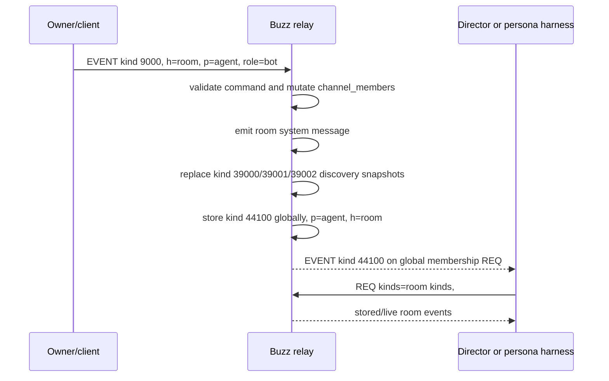
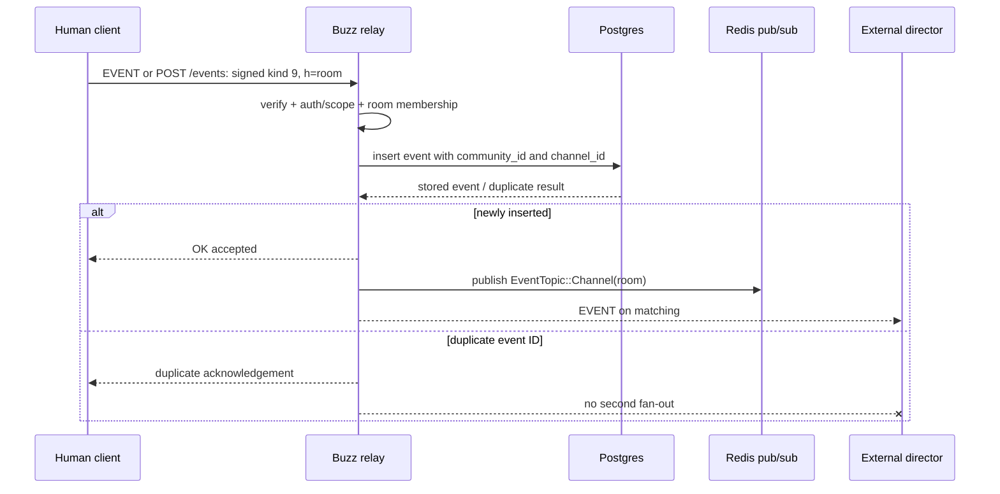
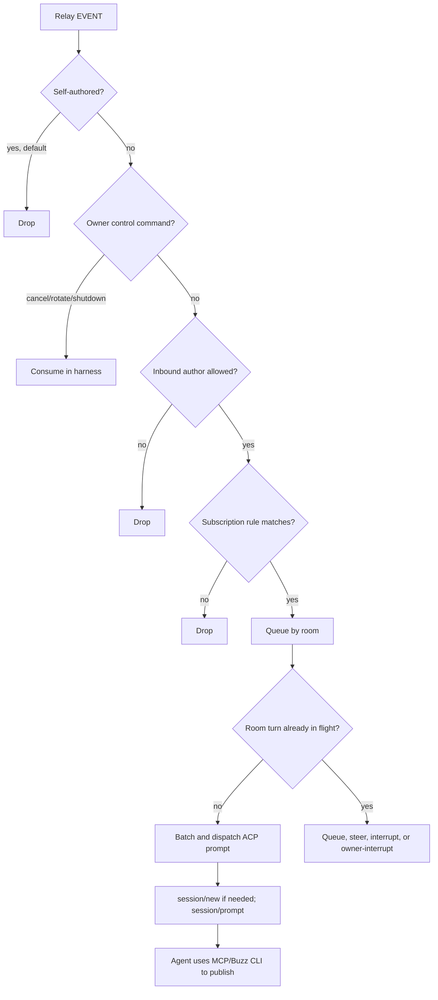
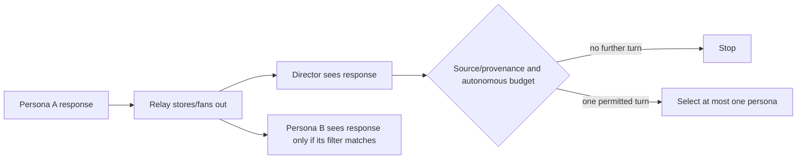

# Buzz room event flow (Phase 0B)

## Evidence baseline

This flow is traced through Buzz source at [`eed74bde2f4797714335ac10c56c0b0244c1def4`](https://github.com/block/buzz/commit/eed74bde2f4797714335ac10c56c0b0244c1def4). It is research only; no relay was deployed.

Labels used throughout:

- **Proven** — implemented in code at the pinned revision.
- **Derived** — follows from composing proven public interfaces, but was not exercised against a live relay in this research task.
- **Gap** — no matching code-level capability was found at the pinned revision.

See [buzz-extension-surface.md](buzz-extension-surface.md) for identity, persistence, persona, ACP, and recommendation detail.

## Protocol/event glossary

| Event or protocol | Meaning in the traced flow | Source |
| --- | --- | --- |
| NIP-01 `REQ`, `EVENT`, `EOSE`, `OK` | WebSocket subscribe, delivery, end-of-stored-events, and publish acknowledgement. `HarnessRelay` constructs `REQ` and parses relay frames. | [`buzz-acp/src/relay.rs`](https://github.com/block/buzz/blob/eed74bde2f4797714335ac10c56c0b0244c1def4/crates/buzz-acp/src/relay.rs#L558-L612), [`send_subscribe`](https://github.com/block/buzz/blob/eed74bde2f4797714335ac10c56c0b0244c1def4/crates/buzz-acp/src/relay.rs#L3240-L3312) |
| NIP-42 | WebSocket challenge/response authentication used by `HarnessRelay::connect`. | [`HarnessRelay::connect`](https://github.com/block/buzz/blob/eed74bde2f4797714335ac10c56c0b0244c1def4/crates/buzz-acp/src/relay.rs#L680-L738) |
| NIP-98 | Signed HTTP authentication for `POST /query`, `/count`, and `/events`. | [`RestClient`](https://github.com/block/buzz/blob/eed74bde2f4797714335ac10c56c0b0244c1def4/crates/buzz-acp/src/relay.rs#L243-L512) |
| NIP-OA auth tag | Owner-signed delegation binding an agent pubkey to its owner; supplied during auth and carried in agent profile. | [`resolve_agent_owner`](https://github.com/block/buzz/blob/eed74bde2f4797714335ac10c56c0b0244c1def4/crates/buzz-acp/src/lib.rs#L135-L160), [`build_profile_event`](https://github.com/block/buzz/blob/eed74bde2f4797714335ac10c56c0b0244c1def4/desktop/src-tauri/src/relay.rs#L466-L507) |
| kind `9` | Stream message. Required `h` tag identifies room; optional NIP-10 `e` tags thread it; `p` tags mention participants. | [`KIND_STREAM_MESSAGE`](https://github.com/block/buzz/blob/eed74bde2f4797714335ac10c56c0b0244c1def4/crates/buzz-core/src/kind.rs#L476-L493), [`build_message`](https://github.com/block/buzz/blob/eed74bde2f4797714335ac10c56c0b0244c1def4/crates/buzz-sdk/src/builders.rs#L216-L245) |
| kinds `9000` / `9001` / `9021` / `9022` | Add member, remove member, request join, leave. These are commands with `h` room scope. | [`buzz-sdk` membership builders](https://github.com/block/buzz/blob/eed74bde2f4797714335ac10c56c0b0244c1def4/crates/buzz-sdk/src/builders.rs#L575-L608), [`build_join`](https://github.com/block/buzz/blob/eed74bde2f4797714335ac10c56c0b0244c1def4/crates/buzz-sdk/src/builders.rs#L713-L717) |
| kinds `39000` / `39002` | Relay-signed NIP-29 room metadata and current member snapshot. `39002` has `d=<room UUID>` and `p=<member, relay, role>` tags. | [`emit_group_discovery_events`](https://github.com/block/buzz/blob/eed74bde2f4797714335ac10c56c0b0244c1def4/crates/buzz-relay/src/handlers/side_effects.rs#L1119-L1234), [`group_members_tags`](https://github.com/block/buzz/blob/eed74bde2f4797714335ac10c56c0b0244c1def4/crates/buzz-relay/src/handlers/side_effects.rs#L1050-L1059) |
| kinds `44100` / `44101` | Relay-signed, globally stored, `p`-gated notifications that the addressed participant was added to or removed from the room; `h` carries the room UUID. | [`buzz-core/src/kind.rs`](https://github.com/block/buzz/blob/eed74bde2f4797714335ac10c56c0b0244c1def4/crates/buzz-core/src/kind.rs#L529-L536), [`emit_membership_notification`](https://github.com/block/buzz/blob/eed74bde2f4797714335ac10c56c0b0244c1def4/crates/buzz-relay/src/handlers/side_effects.rs#L908-L995) |
| ACP `initialize` → `session/new` → `session/prompt` | Harness-to-agent stdio JSON-RPC lifecycle. Cancellation is `session/cancel`; result carries `stopReason`. | [`buzz-acp/src/acp.rs`](https://github.com/block/buzz/blob/eed74bde2f4797714335ac10c56c0b0244c1def4/crates/buzz-acp/src/acp.rs#L1-L10), [`StopReason`](https://github.com/block/buzz/blob/eed74bde2f4797714335ac10c56c0b0244c1def4/crates/buzz-acp/src/acp.rs#L44-L76) |

## A. Agent joins a room and begins observing



### Proven membership steps

1. The client builds kind `9000` with `h`, `p`, and optional role ([`build_add_member`](https://github.com/block/buzz/blob/eed74bde2f4797714335ac10c56c0b0244c1def4/crates/buzz-sdk/src/builders.rs#L575-L590)).
2. Relay ingest verifies signature, timestamp, authenticated-pubkey equality, scopes, room access, and command authorization before executing command kinds ([`ingest_event_inner`](https://github.com/block/buzz/blob/eed74bde2f4797714335ac10c56c0b0244c1def4/crates/buzz-relay/src/handlers/ingest.rs#L2160-L2280), [room access checks](https://github.com/block/buzz/blob/eed74bde2f4797714335ac10c56c0b0244c1def4/crates/buzz-relay/src/handlers/ingest.rs#L2453-L2551)).
3. The add-member side effect mutates `channel_members`, emits a durable system message, refreshes `39000`/`39001`/`39002`, then emits kind `44100` to the target ([`handle_put_user`](https://github.com/block/buzz/blob/eed74bde2f4797714335ac10c56c0b0244c1def4/crates/buzz-relay/src/handlers/side_effects.rs#L1387-L1434)).
4. `buzz-acp` always subscribes to `44100`/`44101` with `#p=<agent>`. On add, it starts a room subscription from the membership event timestamp to close the invite/message race; on remove, it unsubscribes, drains queued room events, and invalidates room sessions ([membership `REQ`](https://github.com/block/buzz/blob/eed74bde2f4797714335ac10c56c0b0244c1def4/crates/buzz-acp/src/relay.rs#L3314-L3359), [main-loop add/remove handling](https://github.com/block/buzz/blob/eed74bde2f4797714335ac10c56c0b0244c1def4/crates/buzz-acp/src/lib.rs#L2633-L2748)).
5. At cold start, `HarnessRelay::discover_channels` queries kind `39002` by the agent `p` tag and then fetches kind `39000` metadata ([`discover_channels`](https://github.com/block/buzz/blob/eed74bde2f4797714335ac10c56c0b0244c1def4/crates/buzz-acp/src/relay.rs#L740-L802)).

### Authority boundary

`channel_members` in relay Postgres is the mutation authority; kind `39002` is its relay-signed projection. Kind `44100`/`44101` is a delivery hint for the addressed participant, not a replacement for querying the current snapshot. The harness additionally rejects exact/stale notification replays before changing subscriptions ([membership dedup](https://github.com/block/buzz/blob/eed74bde2f4797714335ac10c56c0b0244c1def4/crates/buzz-acp/src/lib.rs#L2642-L2685)).

## B. Human message: client → durable storage → live observers



### Proven message-ingest steps

1. `buzz-sdk::build_message` constructs kind `9`, requires `h=<room UUID>`, allows optional thread and mention tags, and bounds content ([`build_message`](https://github.com/block/buzz/blob/eed74bde2f4797714335ac10c56c0b0244c1def4/crates/buzz-sdk/src/builders.rs#L216-L245)). `buzz messages send` signs and submits that builder after checking mentioned pubkeys against kind `39002` ([`buzz-cli/src/commands/messages.rs`](https://github.com/block/buzz/blob/eed74bde2f4797714335ac10c56c0b0244c1def4/crates/buzz-cli/src/commands/messages.rs#L611-L712)).
2. Both WebSocket `EVENT` and HTTP `POST /events` enter the same `ingest_event` pipeline ([`ingest.rs` module contract](https://github.com/block/buzz/blob/eed74bde2f4797714335ac10c56c0b0244c1def4/crates/buzz-relay/src/handlers/ingest.rs#L1-L4)). The pipeline verifies event signature, time/content bounds, event-author/authenticated-identity match, required scope, room membership, and `h` presence for messages ([`ingest_event_inner`](https://github.com/block/buzz/blob/eed74bde2f4797714335ac10c56c0b0244c1def4/crates/buzz-relay/src/handlers/ingest.rs#L2160-L2279), [channel scope](https://github.com/block/buzz/blob/eed74bde2f4797714335ac10c56c0b0244c1def4/crates/buzz-relay/src/handlers/ingest.rs#L2391-L2551)).
3. Ordinary events use `insert_event_with_thread_metadata`; replaceable kinds use replacement paths. A duplicate/dominated write returns before side effects and fan-out ([storage dispatch](https://github.com/block/buzz/blob/eed74bde2f4797714335ac10c56c0b0244c1def4/crates/buzz-relay/src/handlers/ingest.rs#L3133-L3198)).
4. Newly stored events schedule `dispatch_persistent_event`: publish on `EventTopic::Channel(room)` or `Global`, fan out to matching local subscriptions, and re-check tenant/private-room access at the send chokepoint ([`dispatch_persistent_event`](https://github.com/block/buzz/blob/eed74bde2f4797714335ac10c56c0b0244c1def4/crates/buzz-relay/src/handlers/event.rs#L340-L420), [`filter_fanout_by_access`](https://github.com/block/buzz/blob/eed74bde2f4797714335ac10c56c0b0244c1def4/crates/buzz-relay/src/handlers/event.rs#L99-L221)).
5. An external director's NIP-01 room `REQ` is therefore sufficient to receive the event, provided its authenticated identity has access. `buzz-acp` builds this as `#h=<room>` plus optional `kinds`, `#p`, and `since` filters ([`send_subscribe`](https://github.com/block/buzz/blob/eed74bde2f4797714335ac10c56c0b0244c1def4/crates/buzz-acp/src/relay.rs#L3240-L3312)).

## C. What stock `buzz-acp` does with an accepted room event



### Proven harness steps

- The main loop handles membership first, then self-ignore, owner controls, author gate, subscription-rule matching, queue insertion, and dispatch in that order ([`buzz-acp/src/lib.rs`](https://github.com/block/buzz/blob/eed74bde2f4797714335ac10c56c0b0244c1def4/crates/buzz-acp/src/lib.rs#L2629-L2990)).
- Default `SubscribeMode::Mentions` uses stream-message/reminder/approval kinds and requires a matching `p` tag unless disabled. `SubscribeMode::All` removes mention filtering ([rule construction](https://github.com/block/buzz/blob/eed74bde2f4797714335ac10c56c0b0244c1def4/crates/buzz-acp/src/lib.rs#L2103-L2137)).
- `filter::match_event` applies ordered room/kind/mention/expression checks and fails closed on expression errors/timeouts ([`match_event`](https://github.com/block/buzz/blob/eed74bde2f4797714335ac10c56c0b0244c1def4/crates/buzz-acp/src/filter.rs#L336-L460)).
- `EventQueue` serializes turns per room, batches events, bounds queue depth and retries, and tracks in-flight deadlines ([`EventQueue`](https://github.com/block/buzz/blob/eed74bde2f4797714335ac10c56c0b0244c1def4/crates/buzz-acp/src/queue.rs#L94-L173), [`push`/`flush_next`](https://github.com/block/buzz/blob/eed74bde2f4797714335ac10c56c0b0244c1def4/crates/buzz-acp/src/queue.rs#L226-L382)).
- The harness does **not** turn generated ACP assistant text into a Buzz message automatically. The agent is instructed to use Buzz CLI/MCP tools to publish; `buzz-agent` explicitly says the visible work is its tool calls and is not a router ([`buzz-agent/README.md`](https://github.com/block/buzz/blob/eed74bde2f4797714335ac10c56c0b0244c1def4/crates/buzz-agent/README.md#L1-L32), [non-goals](https://github.com/block/buzz/blob/eed74bde2f4797714335ac10c56c0b0244c1def4/crates/buzz-agent/README.md#L331-L343)).

## D. Derived external-director flow without Buzz modification

This is the minimal thin-extension design that the source permits. It is **derived**, not yet proven by a live Phase 0 spike.

```mermaid
sequenceDiagram
    participant H as Human
    participant R as Unmodified Buzz relay
    participant D as Green Room director
    participant G as Green Room persona runtime

    H->>R: signed kind 9 (h=room)
    R-->>D: EVENT via #h room subscription
    D->>D: dedup source event ID
    D->>D: enforce pause, depth, cooldown, budget
    D->>D: select zero or one persona
    alt silence
        D->>D: persist silence decision
    else one selected persona
        D->>G: bounded context + invitation
        G-->>D: candidate speech or silence
        D->>D: re-check cancellation and decision state
        D->>R: signed kind 9 as selected persona, h=room, e=source
        R-->>H: EVENT response
        R-->>D: EVENT response
        D->>D: recognize own/provenance event; do not schedule recursively unless budget permits
    end
```

### Why observation works

**Proven interfaces being composed:**

- A member identity can subscribe to all kind-9 events in a room using `#h` without `#p` ([`send_subscribe`](https://github.com/block/buzz/blob/eed74bde2f4797714335ac10c56c0b0244c1def4/crates/buzz-acp/src/relay.rs#L3240-L3312)).
- Relay fan-out sends newly stored matching events after access checks ([`event.rs`](https://github.com/block/buzz/blob/eed74bde2f4797714335ac10c56c0b0244c1def4/crates/buzz-relay/src/handlers/event.rs#L340-L445)).
- Reconnect can replay from per-room `since` watermarks, while event-ID dedup suppresses overlap ([`HarnessRelay` reconnect state](https://github.com/block/buzz/blob/eed74bde2f4797714335ac10c56c0b0244c1def4/crates/buzz-acp/src/relay.rs#L1014-L1217)).

### Why one direct response works

**Proven interfaces being composed:**

- The selected persona's key can sign a kind-9 event built with `h=<room>` and an optional NIP-10 reply reference ([`build_message`](https://github.com/block/buzz/blob/eed74bde2f4797714335ac10c56c0b0244c1def4/crates/buzz-sdk/src/builders.rs#L216-L245)).
- The signed event can be submitted over WebSocket or NIP-98 `POST /events`; both use the same relay ingest path ([`RestClient::submit_event`](https://github.com/block/buzz/blob/eed74bde2f4797714335ac10c56c0b0244c1def4/crates/buzz-acp/src/relay.rs#L497-L512), [`ingest.rs`](https://github.com/block/buzz/blob/eed74bde2f4797714335ac10c56c0b0244c1def4/crates/buzz-relay/src/handlers/ingest.rs#L1-L4)).
- The relay enforces that the event signer matches the authenticated identity and that identity may write in the room ([`ingest_event_inner`](https://github.com/block/buzz/blob/eed74bde2f4797714335ac10c56c0b0244c1def4/crates/buzz-relay/src/handlers/ingest.rs#L2242-L2274), [membership gate](https://github.com/block/buzz/blob/eed74bde2f4797714335ac10c56c0b0244c1def4/crates/buzz-relay/src/handlers/ingest.rs#L2460-L2551)).

### Identity constraint

The director cannot publish **as** a persona unless it possesses that persona's private key. This is a deliberate relay boundary, not an extension limitation. Recommended design: a supervisor owns isolated per-persona signer handles and invokes only the selected runtime; the director decision logic does not receive raw key material.

### If personas remain independent stock `buzz-acp` processes

A no-source-change alternative is:

1. configure every persona as mention-only;
2. configure the director identity as an allowed author or same-owner sibling;
3. director publishes a kind-9 event with a `p` tag only for the selected persona; and
4. only that persona's relay subscription matches.

This is technically thin, but the invitation is a normal durable room message and therefore appears in transcript/history. No source evidence shows a private room-scoped scheduling event that stock `buzz-acp` consumes while hiding it from room history.

## E. Response publication and recursive-loop risk



### Existing controls

- Default `buzz-acp` self-ignore drops an agent's own events ([`lib.rs`](https://github.com/block/buzz/blob/eed74bde2f4797714335ac10c56c0b0244c1def4/crates/buzz-acp/src/lib.rs#L2751-L2754)).
- Mention-only filtering prevents unrelated personas from seeing a response as work unless they are mentioned ([rule construction](https://github.com/block/buzz/blob/eed74bde2f4797714335ac10c56c0b0244c1def4/crates/buzz-acp/src/lib.rs#L2103-L2137)).
- Relay duplicate event IDs are not fanned out twice; harness replay overlap is deduplicated by event ID ([`ingest.rs`](https://github.com/block/buzz/blob/eed74bde2f4797714335ac10c56c0b0244c1def4/crates/buzz-relay/src/handlers/ingest.rs#L3192-L3198), [`TwoGenDedup`](https://github.com/block/buzz/blob/eed74bde2f4797714335ac10c56c0b0244c1def4/crates/buzz-acp/src/relay.rs#L1014-L1062)).
- One `buzz-acp` process allows only one in-flight turn per room; `buzz-agent` can cap model/tool rounds and cancellation wins its loop checks ([`EventQueue`](https://github.com/block/buzz/blob/eed74bde2f4797714335ac10c56c0b0244c1def4/crates/buzz-acp/src/queue.rs#L94-L173), [`buzz-agent/src/agent.rs`, `RunCtx::run`](https://github.com/block/buzz/blob/eed74bde2f4797714335ac10c56c0b0244c1def4/crates/buzz-agent/src/agent.rs#L318-L397)).

### Missing ensemble invariant

No Buzz component shown above coordinates **across** several persona processes. Green Room must add all of the following outside the relay:

- durable source-event claim/dedup;
- source class (`human`, `director`, `persona`, `control`);
- autonomous depth and total fan-out budget;
- one selected persona or explicit silence;
- per-persona cooldown and consecutive-turn cap;
- room pause/emergency-stop generation epoch;
- response publish idempotency record; and
- provenance linking response to source event and director decision.

A practical preliminary provenance shape is a NIP-10 reply `e` tag plus a Green Room-specific tag containing an opaque decision ID. **Gap:** this exact tag has not been validated against Buzz clients or relay allowlists and belongs in the live spike.

## F. Cancellation flow

```mermaid
sequenceDiagram
    participant O as Owner/client
    participant R as Relay
    participant H as buzz-acp
    participant A as ACP agent

    alt room command
        O->>R: kind 9 "!cancel", p=agent, h=room
        R-->>H: EVENT
        H->>H: verify owner; consume command
    else encrypted observer control
        O->>R: kind 24200 cancel_turn, owner-encrypted
        R-->>H: owner-addressed control frame
        H->>H: verify signature/sender/freshness; decrypt
    end
    H->>A: session/cancel
    A-->>H: stopReason=cancelled
```

### Proven controls

- `!cancel` must be a kind-9 message from the resolved owner that mentions the agent; it is consumed and not forwarded to the model ([`buzz-acp/src/lib.rs`](https://github.com/block/buzz/blob/eed74bde2f4797714335ac10c56c0b0244c1def4/crates/buzz-acp/src/lib.rs#L2781-L2812)).
- `!rotate` cancels an in-flight turn or invalidates an idle room session; `!shutdown` exits the harness ([same main-loop block](https://github.com/block/buzz/blob/eed74bde2f4797714335ac10c56c0b0244c1def4/crates/buzz-acp/src/lib.rs#L2756-L2857)).
- Relay observer control verifies event signature, exact owner sender, a freshness window, and encrypted payload before dispatching `cancel_turn` ([`handle_relay_observer_control_event`](https://github.com/block/buzz/blob/eed74bde2f4797714335ac10c56c0b0244c1def4/crates/buzz-acp/src/lib.rs#L1086-L1150)).
- ACP cancellation and timeout errors are explicit; `buzz-agent` checks cancellation at loop boundaries and advertises cancellation as a security boundary ([`buzz-acp/src/acp.rs`](https://github.com/block/buzz/blob/eed74bde2f4797714335ac10c56c0b0244c1def4/crates/buzz-acp/src/acp.rs#L44-L110), [`buzz-agent/README.md`](https://github.com/block/buzz/blob/eed74bde2f4797714335ac10c56c0b0244c1def4/crates/buzz-agent/README.md#L295-L309)).

### Green Room requirement beyond Buzz

Emergency stop must cancel both director and persona work and advance a persisted room generation epoch. A late provider result from the prior epoch must be discarded before publication. Buzz proves per-harness cancellation signaling, but not this cross-runtime room-wide fence.

## G. Crash/reconnect behavior relevant to a director

- `HarnessRelay` stores per-room last-seen timestamps, uses a skewed `since` replay on reconnect, and removes an event from dedup if local backpressure dropped it so replay can recover it ([`BgState`](https://github.com/block/buzz/blob/eed74bde2f4797714335ac10c56c0b0244c1def4/crates/buzz-acp/src/relay.rs#L1064-L1217), [delivery/backpressure path](https://github.com/block/buzz/blob/eed74bde2f4797714335ac10c56c0b0244c1def4/crates/buzz-acp/src/relay.rs#L2140-L2274)).
- `EventQueue` requeues transiently failed batches with exponential backoff and eventually dead-letters them ([`EventQueue::requeue`](https://github.com/block/buzz/blob/eed74bde2f4797714335ac10c56c0b0244c1def4/crates/buzz-acp/src/queue.rs#L414-L500)).
- These are process-memory mechanisms. A Green Room director needs durable claims because a crash after model completion but before/after relay publication creates an acknowledgement ambiguity that memory-only dedup cannot resolve.

Recommended spike invariant:

```text
unique(room_id, source_event_id, policy_version) ->
  pending | silence | selected(persona_id) | publishing(event_id) | published(event_id) | cancelled
```

Before publishing, construct and persist the signed response event ID. On retry, submit the exact same signed event. Relay event-ID dedup then turns an ambiguous retry into an idempotent write rather than a second response.

## Bottom line

- **Proven:** an authenticated external member can observe room events and publish its own signed room message through unmodified Buzz.
- **Derived and recommended for the spike:** an external director can choose zero or one persona runtime and submit one persona-signed response if Green Room supervises isolated signer/runtime handles.
- **Proven but transcript-visible alternative:** mention only the selected independently running `buzz-acp` persona.
- **Gap:** no stock invisible scheduler/control event, no cross-persona at-most-one invariant, no room-wide cancellation epoch, and no durable director decision store.
